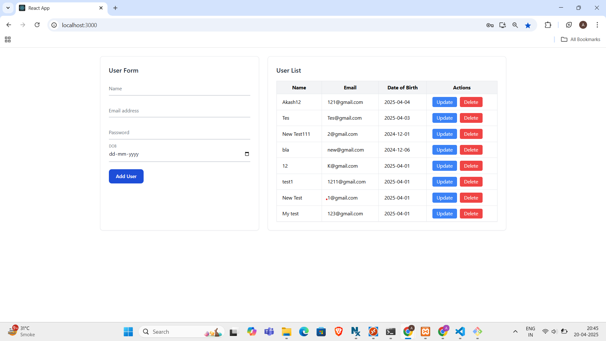
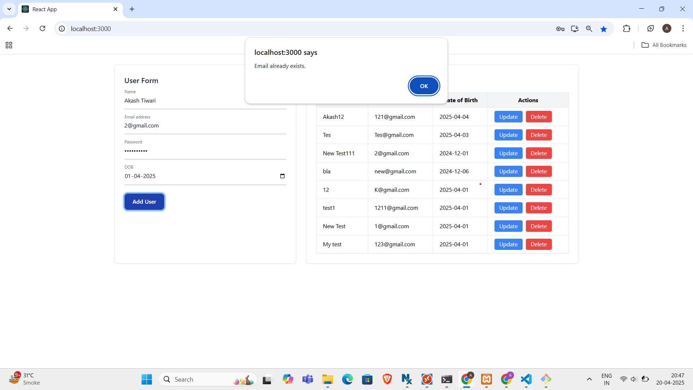
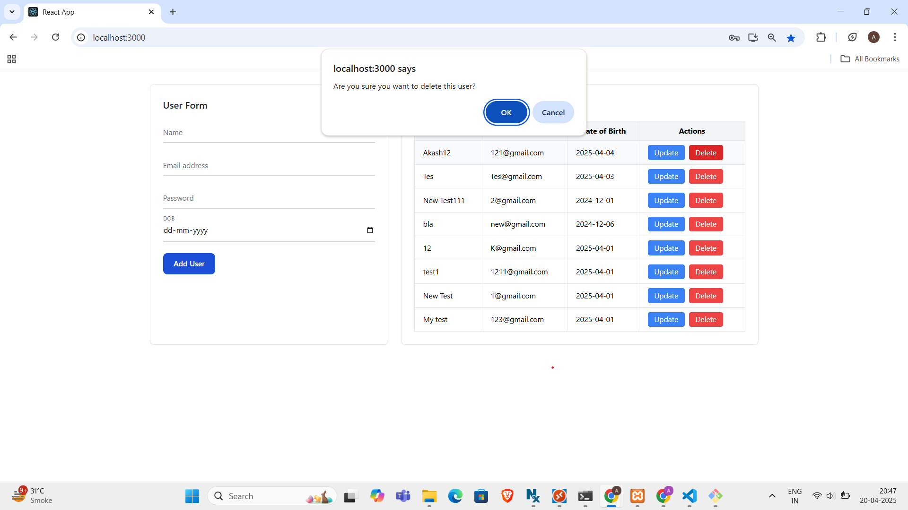

# 👥 User Management System (React + PHP + MySQL)
A full-stack user management system built using **React** for the frontend and **PHP** with **MySQL** for the backend. This project demonstrates CRUD operations with proper validations, CORS handling, and secure password hashing.

---

## 📚 Features

- ✅ Add new users
- 🔍 View all active users
- ✏️ Update user details
- ❌ Soft delete users (`is_deleted` flag)
- 🔒 Passwords stored securely with bcrypt
- 📧 Duplicate email check before insert/update
- ❗ Detailed input validations with alerts
- 🔁 Dynamic switching between Add and Update modes

--- 

## 🌐 Frontend (React)

### Setup

```bash
cd frontend
npm install
npm start
```
---
## Database Setup

```
CREATE DATABASE user_data;

USE DATABASE user_data;

CREATE TABLE `users` (
  `id` INT NOT NULL AUTO_INCREMENT PRIMARY KEY,
  `name` VARCHAR(255) NOT NULL,
  `email` VARCHAR(255) NOT NULL UNIQUE,
  `password` VARCHAR(255) NOT NULL,
  `dob` DATE NOT NULL,
  `is_deleted` TINYINT(1) DEFAULT 0
);
```

## Validation
1.Name Cannot Contain Special Characters or Numbers
2.Password Should be greater than 6 characters

## Images

### Screen View:


### Duplicate Email:


### Delete Confirmation:


** !! Use .env for other configuration, didn't git-ignored for better understanding.!! **
